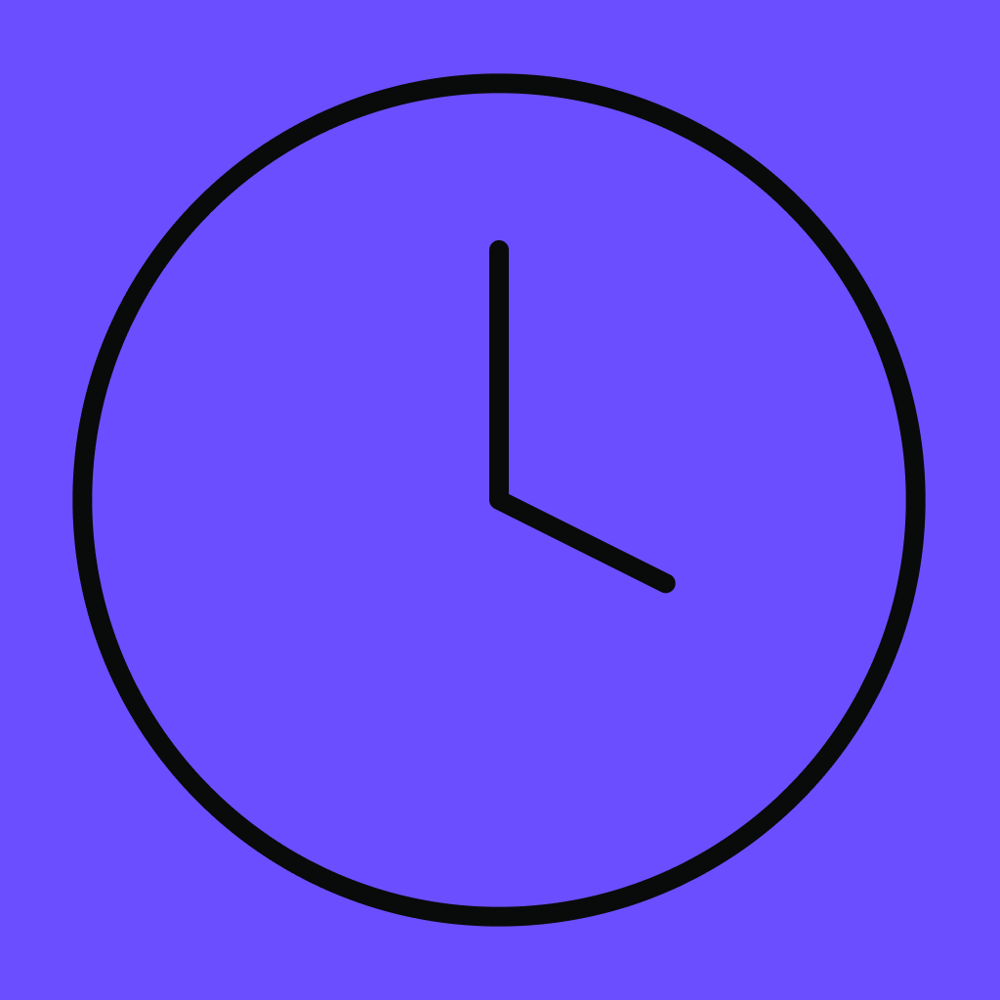

<!-- App Icon -->

    
    <h2>Weasley Clock</h2>

    Weasley clock is a social media application created for groups of friends to easilly, and graphically see each others status' on a clock face. This application was created for my <a href="https://www.gla.ac.uk/coursecatalogue/course/?code=COMPSCI4025P">Level 4 individual project</a> at the University of Glasgow as part of my BSc (Hons) Computer Science degree.

## :page_facing_up: Documentation

<table>
<tbody>
    <tr>
        <td><b>Technologies Used</b></td>
        <td>
        
        
        
        
        
        
</tbody>
</table>

## :compass: Project Layout

- [`.`](#) Root of the repository

## :scroll: License